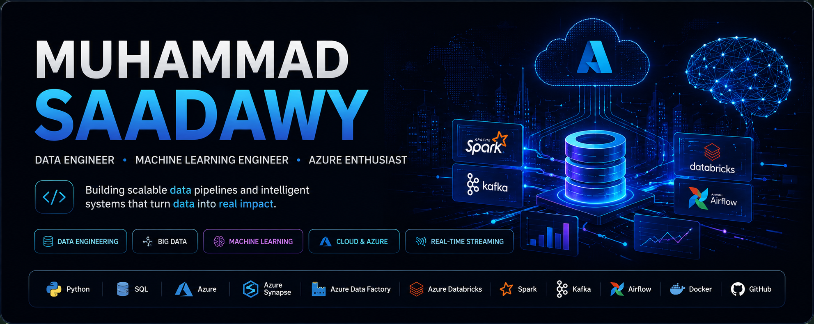

<p align="center">
  
</p>

# 

<div align="center">


</div>

---

# 👨‍💻 About Me

I'm **Muhammad Mostafa Saadawy Amin**, a passionate **Data Engineer** and **Machine Learning Engineer** focused on transforming data into intelligent solutions.

My experience spans Data Engineering, Big Data Processing, Machine Learning, NLP, Cloud Analytics, and Real-Time Data Systems. I enjoy building scalable ETL pipelines, designing data warehouses, developing predictive models, and deploying production-ready AI applications.

### Data Engineer | Machine Learning Engineer | Big Data Enthusiast | Azure Cloud Learner

* 🔭 Building Data Engineering & Machine Learning Projects
* 🤖 Interested in AI, NLP, Predictive Analytics & MLOps
* ☁️ Working with Azure Cloud Data Services
* 📊 Passionate about Data Warehousing & Analytics Engineering
* ⚡ Exploring Distributed Systems & Real-Time Streaming
* 🎯 Goal: Becoming an AI & Data Platform Architect

---

# 🏆 Highlights

✅ Built 10+ End-to-End ETL Pipelines

✅ Designed 5+ Data Warehouses using Star Schema

✅ Improved Query Performance by 40%

✅ Processed Millions of Records using Spark, Hadoop & Hive

✅ Developed Multiple End-to-End Machine Learning Solutions

✅ Built NLP Applications for Real-Time Predictions

✅ Deployed AI Applications using Streamlit & REST APIs

✅ Experienced with Azure Analytics & Data Engineering Services

---

# 🚀 Current Focus

```yaml
Data Engineering:
  - ETL Pipelines
  - Data Warehousing
  - Data Modeling
  - Batch Processing
  - Stream Processing

Machine Learning:
  - NLP Applications
  - Predictive Analytics
  - Model Deployment
  - MLOps Fundamentals

Big Data:
  - Apache Spark
  - Kafka
  - Hadoop
  - Hive

Cloud:
  - Azure Synapse Analytics
  - Azure Data Factory
  - Azure Databricks
  - Azure Stream Analytics

DevOps:
  - Docker
  - GitHub Actions
  - CI/CD
```

---

# 🛠️ Tech Stack

## Programming Languages

<p>

</p>

## Data Engineering

* ETL Pipelines
* Data Warehousing
* Data Modeling
* Star Schema
* Batch Processing
* Streaming Processing
* Apache Airflow
* dbt

## Big Data

* Apache Spark
* PySpark
* Apache Kafka
* Hadoop
* Hive
* Spark Structured Streaming
* Delta Lake

## Machine Learning & AI

* Scikit-Learn
* XGBoost
* LightGBM
* Random Forest
* Feature Engineering
* Model Evaluation
* NLP
* TF-IDF
* NLTK
* Streamlit
* Joblib

## Cloud & Databases

* Azure Synapse Analytics
* Azure Data Factory
* Azure Databricks
* Azure Stream Analytics
* PostgreSQL
* MySQL
* Relational Databases
* NoSQL Databases

## DevOps & Tools

<p>

</p>

* Docker Compose
* GitHub Actions
* REST APIs
* CI/CD Pipelines
* Streamlit Cloud

---

## 🏅 Certifications & Technologies


---

# 💼 Professional Experience

## Junior Data Engineer Trainee

### DEPI Scholarship Program | MCIT

**Jun 2025 – Dec 2025**

* Built and maintained 10+ batch and streaming ETL pipelines using Python, SQL, Apache Spark, Apache Kafka, and Apache Airflow.
* Designed analytical data warehouses using Star Schema modeling.
* Optimized analytical queries and improved performance by up to 40%.
* Processed millions of records using Spark, Hadoop, and Hive.
* Implemented cloud analytics solutions on Microsoft Azure.
* Automated deployments and monitoring using GitHub Actions and CI/CD workflows.

---

## Machine Learning Trainee

### National Telecommunication Institute (NTI)

**Aug 2025 – Sep 2025**

* Developed machine learning models using Scikit-Learn, Pandas, and NumPy.
* Applied feature engineering and hyperparameter tuning techniques.
* Built supervised and unsupervised learning solutions.
* Deployed machine learning applications using Streamlit and REST APIs.

---

# 🚀 Featured Projects

## 🏙️ Smart City – Real-Time Data Pipeline

An end-to-end real-time data platform simulating smart city IoT ecosystems including vehicles, weather stations, GPS sensors, cameras, and emergency systems.

### Technologies

Python • Apache Kafka • Apache Spark • Docker • Docker Compose

🔗 Repository:
https://github.com/Saadawy-AI/SmartCity

---

## 🚗 Road Collision Severity Prediction

An end-to-end Machine Learning system that predicts road accident severity using real-world traffic accident datasets.

### Key Features

* Data Cleaning & Feature Engineering
* Exploratory Data Analysis (EDA)
* Model Comparison & Optimization
* XGBoost & LightGBM Implementation
* Interactive Streamlit Deployment

### Technologies

Python • Scikit-Learn • XGBoost • LightGBM • Streamlit • Pandas

🔗 Repository:
https://github.com/Saadawy-AI/Road-Collisions-ML

---

## 📧 Spam Email Classifier

A Natural Language Processing (NLP) application that classifies emails as spam or legitimate using machine learning techniques.

### Key Features

* Text Preprocessing
* Tokenization & Lemmatization
* TF-IDF Vectorization
* Model Persistence with Joblib
* Streamlit Deployment

### Technologies

Python • NLTK • TF-IDF • Scikit-Learn • Streamlit

🔗 Repository:
https://github.com/Saadawy-AI/spam-classifier-streamlit

---

## 🎗️ Breast Cancer Classification

Machine Learning solution for medical diagnosis prediction based on clinical features.

### Technologies

Python • Pandas • NumPy • Scikit-Learn • Matplotlib • Seaborn

🔗 Repository:
https://github.com/Saadawy-AI/Breast-Canser-Model

---

# ⭐ Featured Repositories

<p align="center">
  <a href="https://github.com/Saadawy-AI/SmartCity">
    
  </a>
  <a href="https://github.com/Saadawy-AI/Road-Collisions-ML">
    
  </a>
</p>

---

# 📈 Data Engineering Roadmap

- ✅ SQL & Databases
- ✅ Python Programming
- ✅ ETL Development
- ✅ Data Warehousing
- ✅ Apache Spark
- ✅ Apache Kafka
- ✅ Azure Data Platform
- 🔄 Data Lakehouse Architecture
- 🔄 MLOps
- 🎯 AI & Data Platform Architecture

---

# 📊 GitHub Analytics

<div align="center">


</div>

---

# 🔥 Contribution Streak

<div align="center">


</div>

---

# 📚 Education

## Bachelor of Computers and Artificial Intelligence

**Minya National University (MNU)**

Expected Graduation: **2027**

Relevant Coursework:

* Data Structures & Algorithms
* Database Systems
* Object-Oriented Programming
* Machine Learning
* Distributed Systems

---

# 🤝 Leadership & Community

* 👨‍🏫 Trainer at Unlimited
* 🏆 Mentor at ICPC MNU Community
* 🤝 Mentor at MENTOR Network
* 📢 Student Activity Administrator

---
# 🐍 Contribution Snake

<div align="center">


</div>

---

# 🌐 Connect With Me

<p align="left">

<a href="https://github.com/Saadawy-AI">

</a>

<a href="https://linkedin.com/in/muhammad-saadawy">

</a>

<a href="mailto:elsameenm@gmail.com">

</a>

</p>

---

### 💡 "Building Data Pipelines Today, Powering Intelligent Decisions Tomorrow."

### ⭐ If you find my projects useful, feel free to explore my repositories and connect with me!
